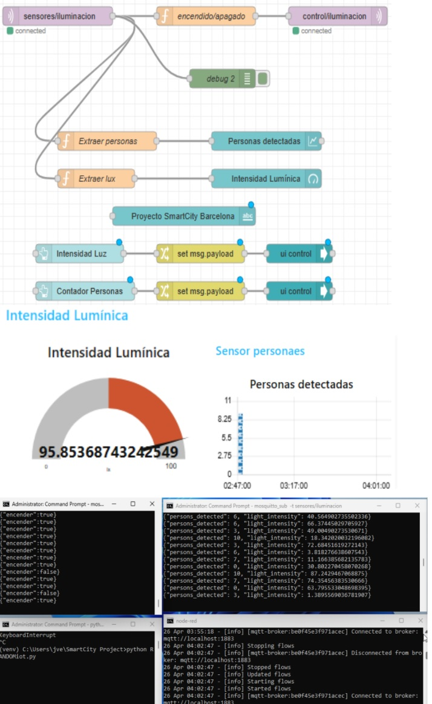

[_RocketTeam%20(1)_page-0001.jpg)](./img/producto1(P7)_RocketTeam%20(1)_page-0001.jpg)
[_RocketTeam%20(1)_page-0002.jpg)](./img/producto1(P7)_RocketTeam%20(1)_page-0002.jpg)
[_RocketTeam%20(1)_page-0003.jpg)](./img/producto1(P7)_RocketTeam%20(1)_page-0003.jpg)
[_RocketTeam%20(1)_page-0004.jpg)](./img/producto1(P7)_RocketTeam%20(1)_page-0004.jpg)
[_RocketTeam%20(1)_page-0005.jpg)](./img/producto1(P7)_RocketTeam%20(1)_page-0005.jpg)
[_RocketTeam%20(1)_page-0006.jpg)](./img/producto1(P7)_RocketTeam%20(1)_page-0006.jpg)
[_RocketTeam%20(1)_page-0007.jpg)](./img/producto1(P7)_RocketTeam%20(1)_page-0007.jpg)
[_RocketTeam%20(1)_page-0008.jpg)](./img/producto1(P7)_RocketTeam%20(1)_page-0008.jpg)
[_RocketTeam%20(1)_page-0009.jpg)](./img/producto1(P7)_RocketTeam%20(1)_page-0009.jpg)
[_RocketTeam%20(1)_page-0010.jpg)](./img/producto1(P7)_RocketTeam%20(1)_page-0010.jpg)
[_RocketTeam%20(1)_page-0011.jpg)](./img/producto1(P7)_RocketTeam%20(1)_page-0011.jpg)
[_RocketTeam%20(1)_page-0012.jpg)](./img/producto1(P7)_RocketTeam%20(1)_page-0012.jpg)

### Uso de Scripts en Python

Este [video](https://youtu.be/ZVfXj07DYG0) muestra el uso de scripts en Python para conectar Mosquitto Broker con Paho y Node-RED a través del protocolo de comunicación IoT MQTT.

### Uso de Node-RED con Dashboard

La configuración de Node-RED incluye un dashboard interactivo que permite monitorear y controlar los datos transmitidos. La conexión entre Mosquitto y el script automatizado en Python se realiza mediante MQTT, permitiendo una comunicación fluida y eficiente entre los componentes del sistema.

### Scripts Utilizados

En la carpeta (./scripts) se encuentran los scripts utilizados para pasar la información en JSON entre los diferentes componentes de la solución. Estos scripts permiten la integración y comunicación entre Mosquitto, Paho, y Node-RED a través del protocolo MQTT, asegurando la correcta transmisión y recepción de datos.

